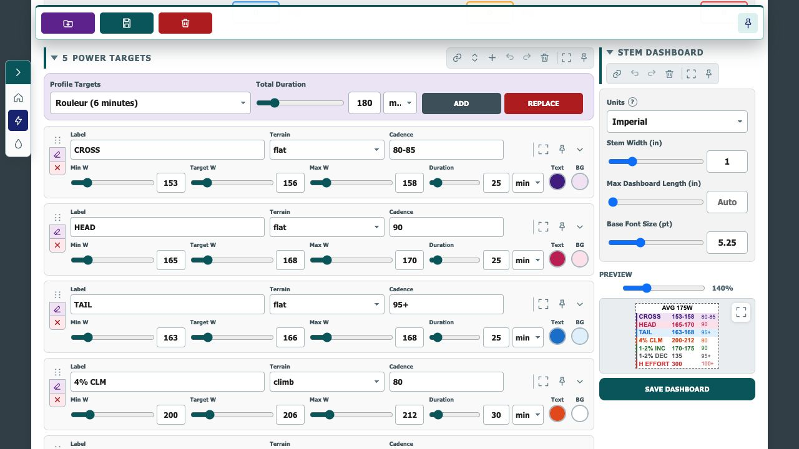
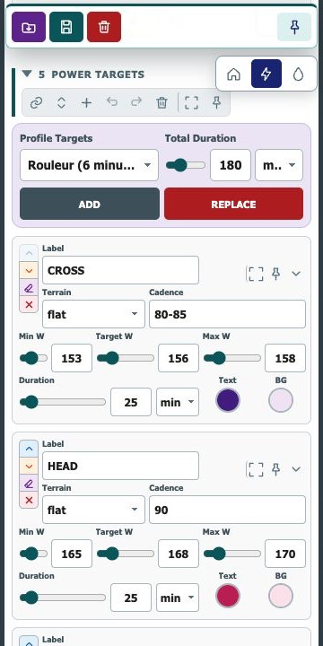
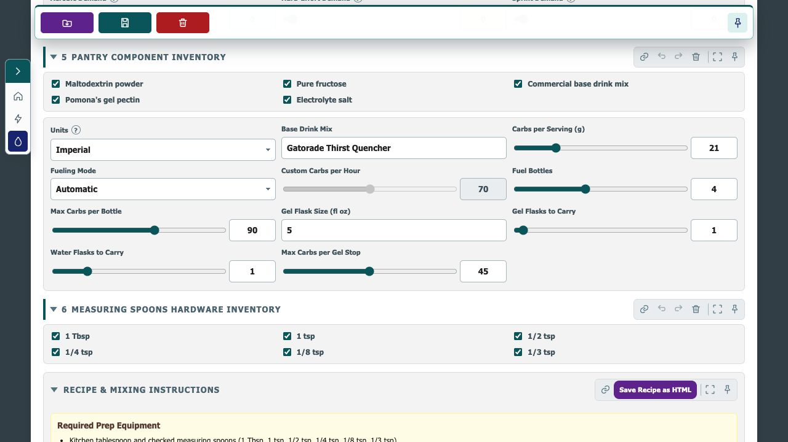
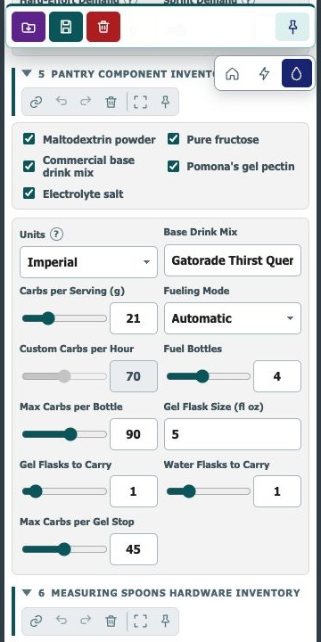

# Velo Tools


A small browser-based cycling planning project built around two related tools:

- **Power Master** creates condition-specific pacing targets and a printable stem dashboard.
- **Fuel Master** combines a ride plan with athlete, route, and nutrition inputs to build a fueling strategy.
- **Conditions Master** will analyze weather, wind, surface, and route conditions before power planning.

The tools are designed to share the same athlete and ride-planning model while keeping their specialized interfaces separate. Open `index.html` to choose a tool.

## Screenshots

### Power Master

<p></p>

### Fuel Master

<p></p>

These maintained screenshots should be refreshed whenever a feature milestone is considered ready for review or release.

## Project structure

```text
velo-tools/
├── scripts/
│   ├── app.js             # Shared observable stores, persistence, downloads, and status helpers
│   ├── activity-parser.js # Shared GPX/TCX route parsing
│   ├── planning-model.js  # Shared schemas, calculations, profiles, and plan normalization
│   ├── planning-ui.js     # Shared planning fields, validation, locking, and file controls
│   ├── power-master.js    # Power Master controller and dashboard rendering
│   ├── fuel-master.js     # Fuel Master controller, fueling logic, and recipe rendering
│   └── utils/
│       ├── math.js        # Pure rounding, conversion, clamping, and distance helpers
│       ├── functions.js   # General cloning and HTML-escaping helpers
│       └── model-config.js # Debug viewports and temporary math-model overrides
├── styles.css             # Shared design tokens and base controls
├── tool-shell.css         # Shared compact tool layout and responsive components
├── power-master.css       # Power-target editor and dashboard-specific styling
├── fuel-master.css        # Fueling, inventory, recipe, and summary styling
├── power-master.html      # Power planning and stem-dashboard interface
├── fuel-master.html       # Fueling calculator and recipe interface
├── index.html             # Landing page for choosing either tool
├── landing.css            # Landing-page presentation
├── icons/                 # Landing, Power Master, and Fuel Master bookmark icons
├── screenshots/           # Maintained desktop and mobile previews
└── README.md
```

Power Master owns detailed pacing targets. When its parameters are loaded into Fuel Master, the shared planning fields can be displayed as read-only and Fuel Master can focus on fueling calculations.

Power Master starts with the established seven condition targets and can add or replace them with duration-scaled profile templates. Target text and background colors are preserved in saved plans and the dashboard preview.

Power-target dragging uses a pinned SortableJS CDN build for animated desktop reordering. The existing native drag implementation remains available as a fallback when the CDN cannot be reached, and compact layouts retain explicit up/down controls.

The controllers now live outside the HTML documents, and both shared planning state and Fuel Master's specialized settings use observable stores. This provides clean component boundaries for an incremental Alpine.js migration.

Suitable bounded numeric fields place a range slider beside precise number entry, following the Stem Dashboard control pattern. This includes planning inputs, fueling quantities, Profile Target duration, and Power Target watts and duration.

Editable sections are collapsible. Their pin links set a stable URL hash so reloading the page returns to the selected section, while edit-history and reset actions stay hidden whenever a section is collapsed.

## Run locally

The shared JavaScript is delivered as classic browser scripts, so either HTML file can be opened directly. A local server is still convenient during development:

```bash
python3 -m http.server 8000 --directory velo-tools
```

Then open `http://localhost:8000/power-master.html` or `http://localhost:8000/fuel-master.html`.

## Debug profiles

Add `debug_profile` to either tool URL to show the **Config Parameters** JSON editor before the shared planning steps. The editor can add and temporarily override a named calculation model for the current browser session.

- `?debug_profile=0` keeps the normal viewport and opens the configuration editor.
- `?debug_profile=mobile1` renders the tool in a true 360 px iframe viewport.
- `?debug_profile=mobile2` renders the tool in a true 414 px iframe viewport.

Removing `debug_profile` disables both the editor and all stored debug overrides.
